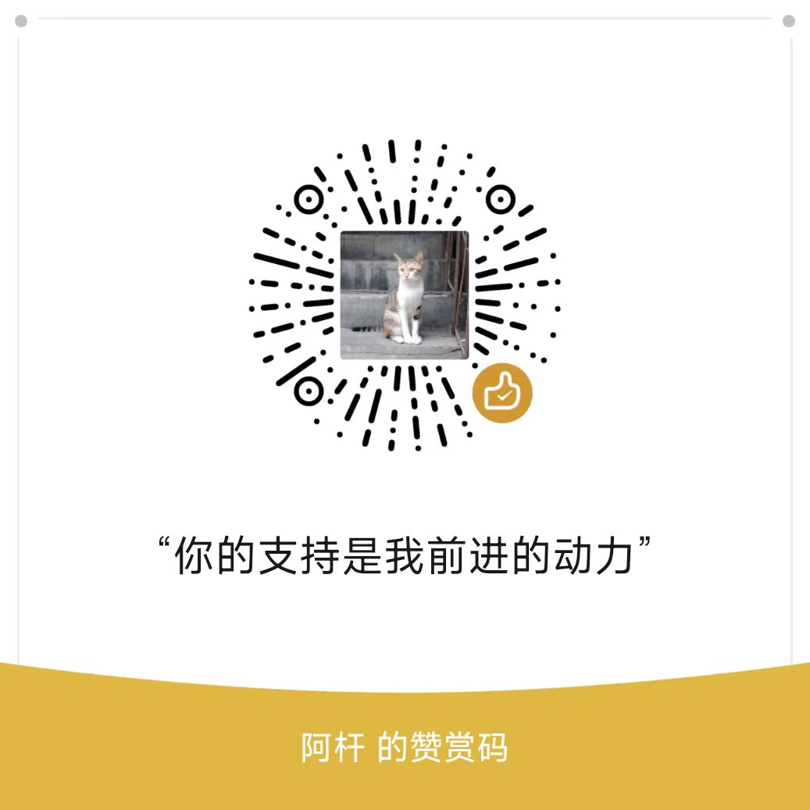

<h1 align="center">SpEL Validator</h1>

<div align="center">

「SpEL Validator」是基于 SpEL 的参数校验包，也是 javax.validation 的扩展增强包，用于简化参数校验。

</div>

## 📚 目录

[简介](#-简介) |
[快速开始](#-快速开始) | [使用指南](#-使用指南) | [示例项目](#-示例项目) | [常见问题](#-常见问题) |
[更新日志](#-更新日志) | [贡献指南](#-贡献指南) | [捐赠支持](#-捐赠支持) | [联系作者](#-联系作者)

## 📝 简介


### 特点

- 强大的参数校验功能，几乎支持所有场景下的参数校验。
- 基于 SpEL（Spring Expression Language） 表达式，支持复杂的校验逻辑，支持上下文属性关联校验。
- 扩展自 javax.validation 包，只新增不修改，无缝集成到 Spring Boot 项目中。
- 支持自定义校验注解，可根据业务需求自定义校验逻辑。
- 无需额外的异常处理，校验失败时会上报到 javax.validation 的异常体系中。
- 支持调用 Spring Bean，可在表达式中使用注入过的 Spring Bean。
- 简单易用，使用方式几乎与 javax.validation 一致，学习成本低，上手快。

## 📦 快速开始

- 添加依赖
  - Latest
    Version: [](https://search.maven.org/search?q=g:cn.sticki%20a:spel-validator)
  - Maven:
    ```xml
    <dependency>
        <groupId>cn.sticki</groupId>
        <artifactId>spel-validator</artifactId>
        <version>Latest Version</version>
    </dependency>
    
    <dependency>
        <groupId>org.hibernate.validator</groupId>
        <artifactId>hibernate-validator</artifactId>
        <version>${hibernate-validator.version}</version>
    </dependency>
    ```

- 在接口参数上使用 `@Valid` 或 `@Validated` 注解

  ```java
  @RestController
  @RequestMapping("/example")
  public class ExampleController {
  
    /**
     * 简单校验示例
     */
    @PostMapping("/simple")
    public Resp<Void> simple(@RequestBody @Valid SimpleExampleParamVo simpleExampleParamVo) {
      return Resp.ok(null);
    }

  }
  ```

- 在实体类上使用 `@SpelValid` 注解，同时在需要校验的字段上使用 `@SpelNotNull` 等约束注解

  ```java
  @Data
  @SpelValid
  public class SimpleExampleParamVo {
  
    @NotNull
    private Boolean switchAudio;
  
    /**
     * 当 switchAudio 为 true 时，校验 audioContent，audioContent 不能为null
     */
    @SpelNotNull(condition = "#this.switchAudio == true", message = "语音内容不能为空")
    private Object audioContent;

  }
  ```

- 添加异常处理器，处理校验异常

  ```java
  @RestControllerAdvice
  public class ControllerExceptionAdvice {

    @ExceptionHandler({BindException.class, MethodArgumentNotValidException.class})
    public Resp<Void> handleBindException(BindException ex) {
      String msg = ex.getFieldErrors().stream()
          .map(error -> error.getField() + " " + error.getDefaultMessage())
          .reduce((s1, s2) -> s1 + "," + s2)
          .orElse("");
      return new Resp<>(400, msg);
    }
  
  }
  ```

- 发起请求，即可看到校验结果
  <details>
  <summary>示例一：@SpelNotNull 校验不通过</summary>

  - 请求体：

    ```json
    {
      "switchAudio": true,
      "audioContent": null
    }
    ```

  - 响应体
    ```json
    {
      "code": 400,
      "message": "audioContent 语音内容不能为空",
      "data": null
    }
    ```

  </details>

  <details>
  <summary>示例二：校验通过</summary>

  - 请求体
    ```json
    {
      "switchAudio": false,
      "audioContent": null
    }
    ```

  - 响应体
    ```json
    {
      "code": 200,
      "message": "成功",
      "data": null
    }
    ```

  </details>

  <details>
  <summary>示例三：@NotNull 校验不通过</summary>

  - 请求体
    ```json
    {
      "switchAudio": null,
      "audioContent": null
    }
    ```

  - 响应体
    ```json
    {
      "code": 400,
      "message": "switchAudio 不能为null",
      "data": null
    }
    ```
  </details>

## 📖 使用指南

## 📦 示例项目

- [spel-validator-example](https://github.com/stick-i/spel-validator-example)

## ❓ 常见问题

## 📅 更新日志

https://github.com/stick-i/spel-validator/releases

## 🤝 贡献指南

## 💰 捐赠支持

| 微信赞赏                                                 | 支付宝赞赏                                            |
|------------------------------------------------------|--------------------------------------------------|
|  |  |

## 📧 联系作者

- Email: sticki@126.com
- 微信: sticki6
- 公众号: 程序员阿杆
